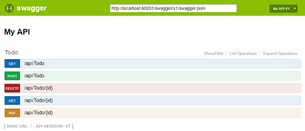

Ocelot API Gateway 
==============================================================

## Description
Example .NET Core Ocelot Api Gateway [Ocelot](https://docs.microsoft.com/en-us/dotnet/architecture/microservices/multi-container-microservice-net-applications/implement-api-gateways-with-ocelot)

## API Gateway

### Swagger
* Swashbuckle.AspNetCore.Swagger
* Swashbuckle.AspNetCore.Gen
* Swashbuckle.AspNetCore.SwaggerUI

## Ocelot
* [Ocelot API Gateway](https://github.com/ThreeMammals/Ocelot)
* Unificar diferentes swagger en Ocelot [Swagger For Ocelot](https://github.com/Burgyn/MMLib.SwaggerForOcelot)

## Related blog articles

* [Swagger](https://docs.microsoft.com/es-es/aspnet/core/tutorials/web-api-help-pages-using-swagger?tabs=visual-studio&view=aspnetcore-3.1)
* [Implementar API Gateway Ocelot](https://docs.microsoft.com/es-es/dotnet/architecture/microservices/multi-container-microservice-net-applications/implement-api-gateways-with-ocelot)
* [Diferencias entre el patrón de puerta de enlace de API y la comunicación directa de cliente a microservicio](https://docs.microsoft.com/es-es/dotnet/architecture/microservices/architect-microservice-container-applications/direct-client-to-microservice-communication-versus-the-api-gateway-pattern)
* [Uso de puertas de enlace de API en microservicios](https://docs.microsoft.com/es-es/azure/architecture/microservices/design/gateway)
* [Pattern: API Gateway / Backends for Frontends](https://microservices.io/patterns/apigateway.html)

## How to run
1. Modify configuration.json
2. Run!
